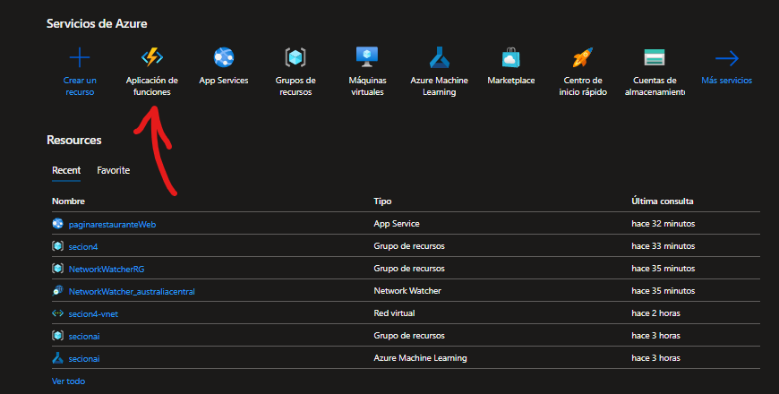
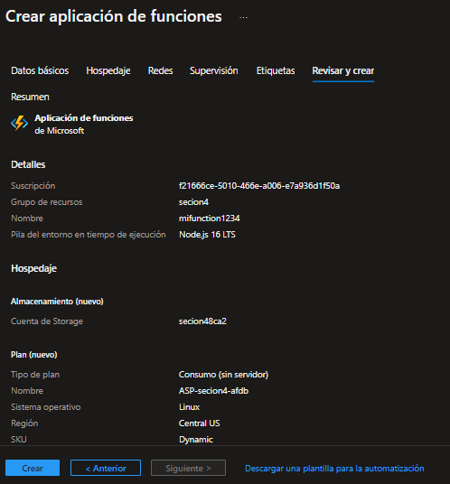
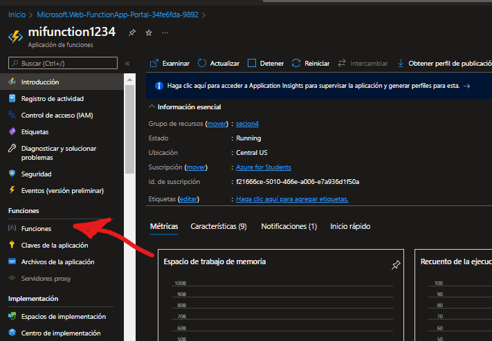
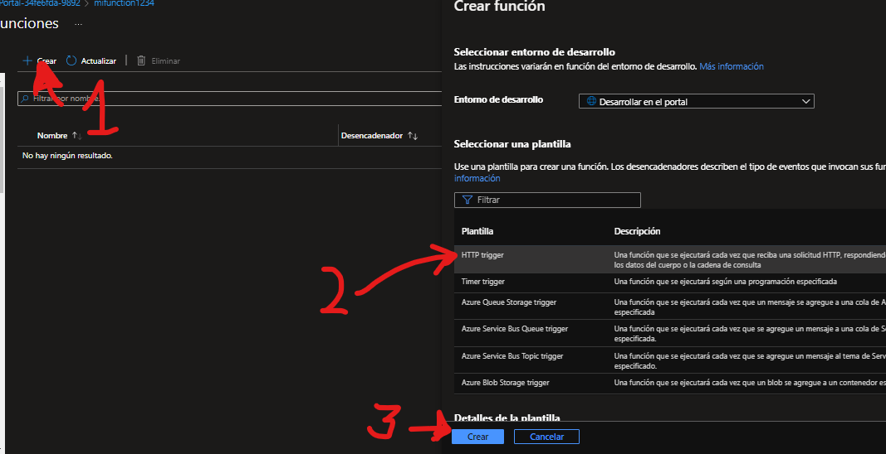
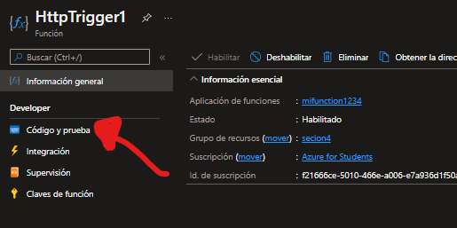
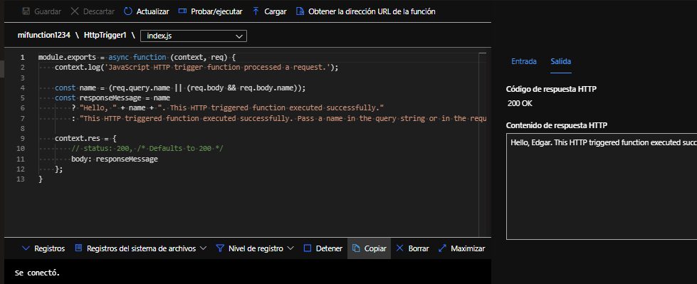

# Performing azure functions.

## Practice 3

We enter function applications in the azure portall([azure](https://portal.azure.com/))  

Create a subscription 

Select us create 

We are heading to functions  

We will click on create and choose a trigger function, which means that when the function receives an http request  

We go to code and test 

Ready now we will be able to achieve our functions.