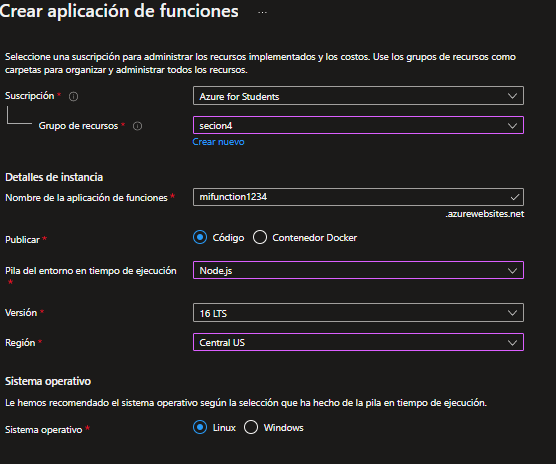

# Performing azure functions.

## Practice 3

-We enter function applications in the azure portall([azure](https://portal.azure.com/))-   

-Create a subscription-  

-Select us create-  

-We are heading to functions-   

-We will click on create and choose a trigger function, which means that when the function receives an http request-  

-We go to code and test-  

-Ready now we will be able to achieve our functions.
